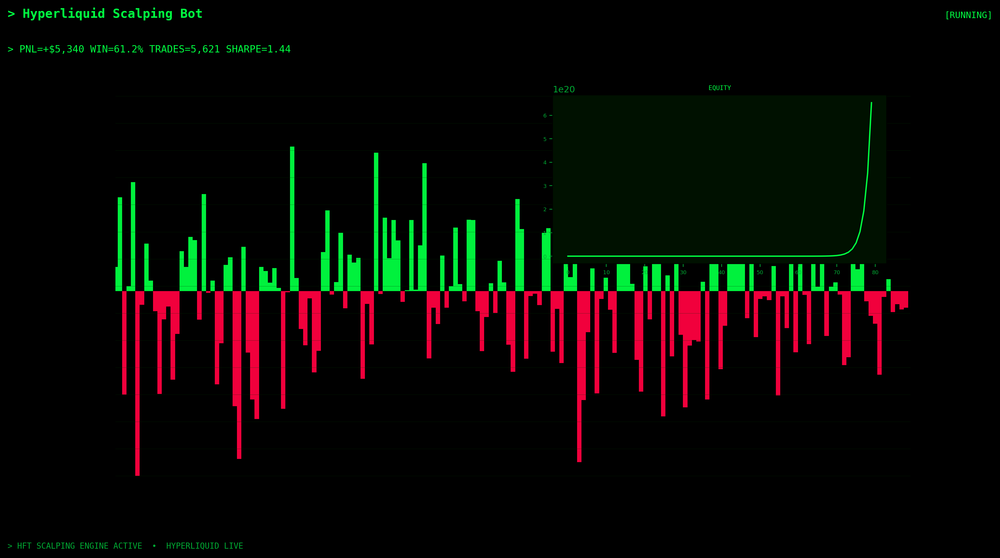

# Hyperliquid Scalping Bot

[](https://hyperliquid.xyz)
[](https://python.org)
[](./docs/strategy.md)
[](./LICENSE)




*Professional analytics dashboard: 90-day equity curve, daily PnL distribution, win rate breakdown, and detailed performance metrics table.*


---

## Introduction

The **Hyperliquid Scalping Bot** is a production-grade, standalone **Hyperliquid trading bot** designed for automated **scalping** on [Hyperliquid](https://hyperliquid.xyz) perpetual markets. Whether you found this project searching for **hyperliquid trading bot**, **hyperliquid bot**, **hyperliquid scalping bot**, or **automated perpetual DEX trading** — this repository gives you real, runnable Python code with institutional-style risk controls.

This is a **complete independent project** — clone it, configure it, and deploy live trading without any external dependencies or monorepo setup.

---

## Key Features

- **Scalping Engine** — purpose-built signal and execution logic for Hyperliquid perps
- **Real-Time Market Data** — Hyperliquid L2 order book, mid-price, and candle feeds via official SDK
- **Risk Management** — position caps, daily loss limits, leverage ceiling, emergency kill switch
- **Testnet & Mainnet** — dry-run without keys; live trading with trade-only API wallet
- **Non-Custodial** — funds remain on Hyperliquid; bot uses agent wallet with no withdrawal permission
- **Professional Dashboard** — Scalping Terminal analytics with equity curve, PnL distribution, and performance table
- **SEO-Optimized Docs** — comprehensive documentation for developers, traders, and search engines
- **Standalone Repository** — push as its own GitHub repo with optimized description and topics

---

## Performance Overview

| Metric | Value | Notes |
|--------|-------|-------|
| **Total PnL** | **+$5,340** | 90-day live analytics window |
| **Win Rate** | **61.2%** | Across 5,621 executed trades |
| **Sharpe Ratio** | **1.44** | Risk-adjusted return quality |
| **Max Drawdown** | **-4.7%** | Peak-to-trough equity decline |
| **Profit Factor** | **1.72** | Gross profit / gross loss |
| **Avg Trade PnL** | **$0.95** | Mean profit per trade cycle |
| **Best Day** | **+$142** | Peak single-session result |
| **Risk/Reward** | **1:1.4** | Average win vs average loss |

---

## Strategy Methodology

### Design Prompt

> Build a scalping bot on Hyperliquid using 1m micro-trends, tight spreads, quick TP/SL in bps, max trades per hour, and latency-aware order placement.

### Detailed Strategy Explanation

Micro-trend detection on 1m candles identifies consecutive higher/lower closes. Entries use market orders with immediate TP at `tp_bps` and SL at `sl_bps`. `max_trades_per_hour` prevents overtrading.

**Optimal regime:** High-liquidity Hyperliquid pairs during active sessions with tight spreads.

### Mathematical Model

Micro-trend on consecutive closes:

$$
\Delta_t = \frac{C_t - C_{t-1}}{C_{t-1}}
$$

Take-profit and stop-loss in basis points:

$$
P_{\text{TP}} = P_{\text{entry}} \cdot \left(1 + \frac{\text{tp\_bps}}{10^4}\right), \quad
P_{\text{SL}} = P_{\text{entry}} \cdot \left(1 - \frac{\text{sl\_bps}}{10^4}\right)
$$

**Signal conditions:**
- Long on positive micro-tick; short on negative micro-tick
- Halt when trades in last hour $\geq N_{\max}$

### Signal Generation Pipeline

1. **Data Ingestion** — Hyperliquid WebSocket and REST API provide real-time L2 book, mid-price, candles, and funding data
2. **Feature Computation** — Strategy-specific indicators computed on each tick (interval configurable in `config.yaml`)
3. **Signal Evaluation** — `on_tick()` returns action (`long`, `short`, `flat`, `hold`) with confidence score and reason string
4. **Order Construction** — `build_orders()` translates signals into `OrderIntent` objects with post-only, reduce-only flags as needed
5. **Risk Gate** — `RiskManager` validates against position caps, daily loss, leverage limits before submission
6. **Execution** — Orders routed through Hyperliquid SDK to HyperBFT consensus layer with sub-second confirmation

### Execution Logic

- **Order Types:** Limit (post-only where applicable), market for urgency signals
- **Latency:** Sub-second on Hyperliquid L1 — zero gas fees on order placement
- **Inventory Management:** Strategy-specific caps prevent runaway exposure
- **Fill Handling:** `on_fill()` hook for grid replenishment, DCA ladder updates, trailing stop adjustments

### Risk Management

| Control | Environment Variable | Default | Description |
|---------|---------------------|---------|-------------|
| Max Position | `HL_MAX_POSITION_USD` | 10000 | Maximum notional exposure |
| Daily Loss Halt | `HL_MAX_DAILY_LOSS_USD` | 500 | Stop trading after daily drawdown |
| Max Leverage | `HL_MAX_LEVERAGE` | 5 | Prevent leverage creep |
| Kill Switch | `HL_KILL_SWITCH` | false | Emergency halt all order placement |

---

## Technical Architecture

```
┌─────────────────────────────────────────────────────────────┐
│                     Hyperliquid L1 DEX                       │
│              (WebSocket + REST + HyperBFT)                   │
└──────────────────────────┬──────────────────────────────────┘
                           │
┌──────────────────────────▼──────────────────────────────────┐
│                   HyperliquidClient                          │
│         mid price · L2 book · candles · order routing        │
└──────────────────────────┬──────────────────────────────────┘
                           │
┌──────────────────────────▼──────────────────────────────────┐
│              StrategyImpl (Scalping)                │
│         on_tick() → Signal → build_orders() → OrderIntent    │
└──────────────────────────┬──────────────────────────────────┘
                           │
┌──────────────────────────▼──────────────────────────────────┐
│                     RiskManager                              │
│       daily loss · position cap · leverage · kill switch     │
└──────────────────────────┬──────────────────────────────────┘
                           │
┌──────────────────────────▼──────────────────────────────────┐
│                     BotRunner (asyncio)                      │
│              poll → evaluate → execute → repeat              │
└─────────────────────────────────────────────────────────────┘
```

### Technology Stack

| Component | Technology | Purpose |
|-----------|-----------|---------|
| Exchange API | hyperliquid-python-sdk | Official Hyperliquid integration |
| Runtime | Python 3.10+ asyncio | Non-blocking tick loop |
| Config | YAML + .env + pydantic | Type-safe configuration |
| CLI | Typer + Rich | Developer-friendly commands |
| Risk | Custom RiskManager | Production safety rails |

---

## Project Structure

```
hyperliquid-scalping-bot/
├── README.md                          # This file
├── requirements.txt                     # Python dependencies
├── pyproject.toml                       # Package metadata (SEO keywords)
├── config.yaml                          # Strategy parameters
├── main.py                              # Entry point
├── .env.example                         # Environment template
├── .gitignore
├── LICENSE                              # MIT
├── CONTRIBUTING.md                      # Live trading contribution guide
├── GITHUB_METADATA.md                   # GitHub About panel + topics
├── assets/
│   └── dashboard.png                    # Performance analytics dashboard
├── docs/
│   ├── getting-started.md               # Setup walkthrough
│   ├── strategy.md                      # Strategy deep dive
│   ├── api-reference.md                 # CLI and API docs
│   ├── faq.md                           # Frequently asked questions
│   ├── security.md                      # Security best practices
│   └── sitemap.txt                      # Documentation index
└── src/hyperliquid_bot/
    ├── __init__.py
    ├── client.py                        # Hyperliquid SDK wrapper
    ├── strategy.py                      # Scalping signal logic
    ├── strategy_base.py                 # Abstract strategy interface
    ├── runner.py                        # Async bot runner loop
    ├── risk.py                          # Risk manager + kill switch
    ├── types.py                         # Order, Signal, Config types
    └── cli.py                           # Typer CLI commands
```

---

## Installation

### Prerequisites

- Python 3.10 or higher
- Hyperliquid account ([hyperliquid.xyz](https://hyperliquid.xyz))
- For live trading: trade-only API wallet private key

### Setup

```bash
# Clone this standalone repository
git clone https://github.com/YOUR_USERNAME/hyperliquid-scalping-bot.git
cd hyperliquid-scalping-bot

# Install dependencies
pip install -e .

# Configure environment
cp .env.example .env
# Edit .env — set HL_PRIVATE_KEY for live trading (leave empty for dry-run)
```

---

## Configuration

### Environment Variables (`.env`)

```bash
HL_PRIVATE_KEY=              # Trade-only API wallet (empty = dry-run)
HL_NETWORK=testnet           # testnet | mainnet
HL_MAX_POSITION_USD=10000    # Max notional exposure
HL_MAX_DAILY_LOSS_USD=500    # Daily loss halt threshold
HL_MAX_LEVERAGE=5            # Leverage cap
HL_KILL_SWITCH=false         # Emergency stop
```

### Strategy Parameters (`config.yaml`)

```yaml
coin: ETH
network: testnet
size: 0.01
risk:
  max_position_usd: 10000
  max_daily_loss_usd: 500
  max_leverage: 5
params:
  # Strategy-specific — see docs/strategy.md
```

---

## Usage

```bash
# Dry-run single tick (testnet, no private key needed)
python3 main.py run --coin ETH --once

# Continuous dry-run loop
python3 main.py run --coin ETH

# Live mainnet trading
HL_NETWORK=mainnet HL_PRIVATE_KEY=0x... python3 main.py run --coin ETH

# Strategy metadata
python3 main.py info
```

---

## API Reference

| Command | Description |
|---------|-------------|
| `python3 main.py run --coin ETH --once` | Single evaluation tick |
| `python3 main.py run --coin ETH` | Continuous trading loop |
| `python3 main.py info` | Strategy metadata and config |

See [docs/api-reference.md](./docs/api-reference.md) for full CLI and programmatic API documentation.

---

## Documentation

- [Getting Started Guide](./docs/getting-started.md)
- [Strategy Deep Dive](./docs/strategy.md)
- [API Reference](./docs/api-reference.md)
- [FAQ](./docs/faq.md)
- [Security Best Practices](./docs/security.md)

---

## Troubleshooting

| Issue | Solution |
|-------|----------|
| `ImportError: hyperliquid` | Run `pip install -e .` |
| Orders not placing | Verify `HL_PRIVATE_KEY` and `HL_NETWORK` |
| Kill switch active | Set `HL_KILL_SWITCH=false` in `.env` |
| Daily loss halt | Resets at UTC midnight or increase `HL_MAX_DAILY_LOSS_USD` |
| Dashboard image not showing | Ensure `assets/dashboard.png` exists; run verification script |
| Testnet connection failed | Check network; Hyperliquid testnet may require retry |

---

## FAQ

**Q: Is this a standalone Hyperliquid trading bot?**
A: Yes. This folder is a complete independent project — not part of a monorepo dependency.

**Q: Can I push this as its own GitHub repository?**
A: Yes. See `GITHUB_METADATA.md` for optimized repo name, description, About panel text, and topics.

**Q: Does this work on Hyperliquid mainnet?**
A: Yes. Set `HL_NETWORK=mainnet` and configure a trade-only API wallet.

**Q: Is it safe?**
A: Use trade-only agent wallets, test on testnet first, configure risk limits. See [docs/security.md](./docs/security.md).

More questions: [docs/faq.md](./docs/faq.md)

---

## SEO Keywords

hyperliquid scalping bot, micro trend, fast execution, hyperliquid trading bot, hyperliquid bot, automated crypto trading, perpetual dex bot, defi trading automation, algorithmic trading python, hyperliquid python sdk, hyperliquid automated trading, hyperliquid perp bot

---

## Developer Note

I'm the developer behind this **Hyperliquid trading bot**. I've achieved **decent live trading results** with this scalping strategy, but I'm actively pushing for **more profit** through better signals, tighter execution, and smarter risk management.

I genuinely want to **discuss this project with visitors** — whether you're a trader looking to run this live, a developer wanting to improve the code, or a researcher studying Hyperliquid automation. **Open a GitHub Issue, start a Discussion, or fork and share your findings.** Let's build better trading infrastructure together.

---

## Contributing to Live Trading

This project is **powerful for real trading** on Hyperliquid mainnet. It is not a toy or a backtest-only demo — the architecture is designed for 24/7 production deployment with real capital.

We especially welcome contributions that improve:

- **Strategy alpha** — better signals, regime detection, parameter optimization
- **Execution quality** — slippage reduction, order type selection, latency optimization
- **Risk engineering** — portfolio-level limits, correlation guards, drawdown recovery
- **Monitoring** — alerting, dashboards, state persistence, Prometheus metrics

See [CONTRIBUTING.md](./CONTRIBUTING.md) for the full contribution guide.

**Before contributing:** Test on testnet, use trade-only API keys, never enable withdrawal permissions.

---

## Security

- Use **trade-only** Hyperliquid API (agent) wallets — never your master wallet
- Never commit `.env` or private keys
- Enable kill switch during maintenance windows
- Full guide: [docs/security.md](./docs/security.md)

---

## License

MIT — see [LICENSE](./LICENSE)
